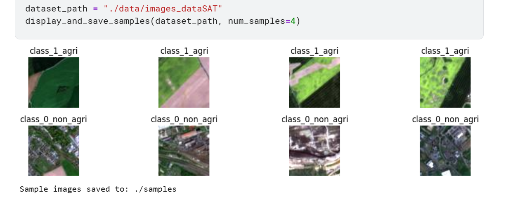
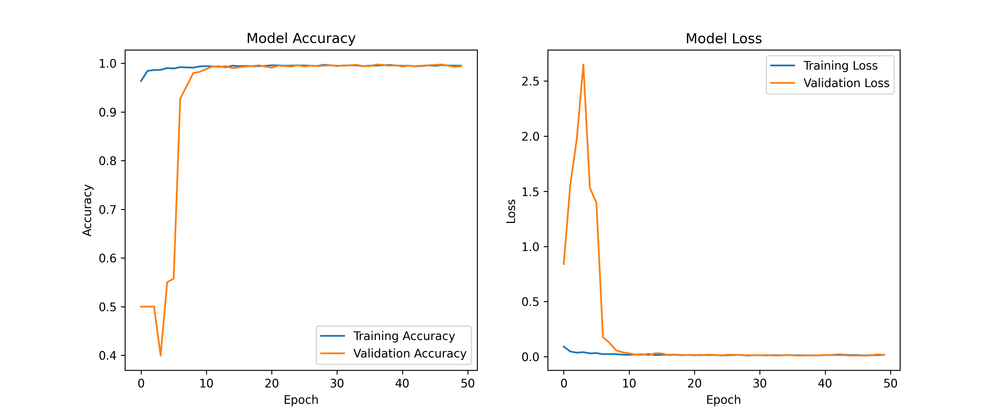
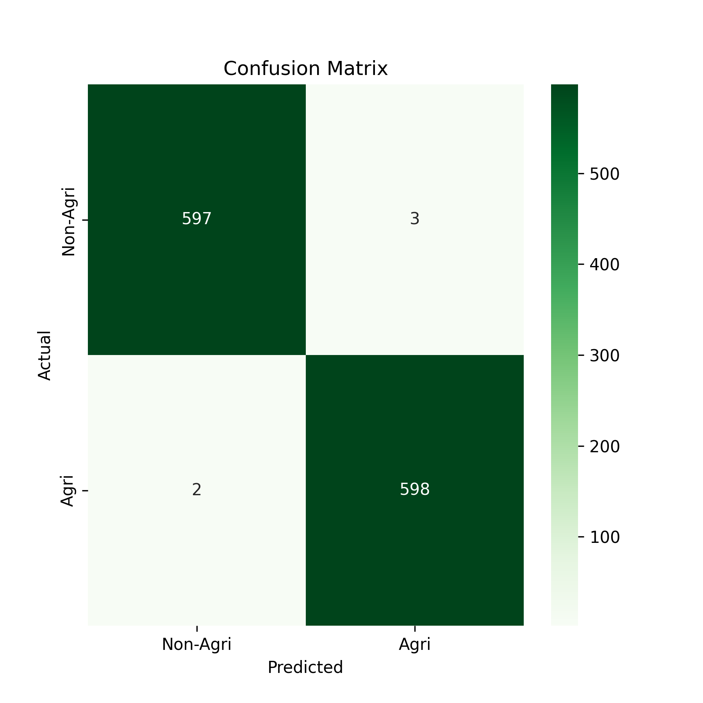

'''
#  Satellite Imagery Classification: Agricultural vs Non-Agricultural

##  Project Overview
This project focuses on **Satellite Land-Use Classification** using **Deep Learning**.  
A **Convolutional Neural Network (CNN)** is implemented to automatically classify satellite images into:

-  **Agricultural land**
-  **Non-Agricultural land**

The workflow includes automated data ingestion, advanced preprocessing with **real-time data augmentation**, and an optimized training strategy using **dynamic learning rate scheduling**.

---

##  Dataset & Visualizations

The dataset is organized using a **directory-based image pipeline**, where images are:
- Normalized
- Augmented (rotation, flipping, zooming)
- Batched efficiently for training

###  Sample Dataset
Representative samples from both classes:

  

###  Model Performance
Training quality and reliability are evaluated using:

- Accuracy & Loss curves
- Confusion Matrix

  
  

---

##  Project Structure
Designed for **scalability, experimentation, and deployment**:

Satellite-Land-Classification/
│
├── data/                     # Dataset storage (ignored in Git)
├── models/                   # Saved models
│   └── best_agriculture_model.keras
│
├── notebooks/                # Jupyter notebooks
│   └── satellite-classification-training.ipynb
│
├── scripts/                  # Modular Python scripts
│   ├── data_loader.py        # Asynchronous download & preprocessing
│   ├── train.py              # CNN model & training pipeline
│   └── predict.py            # Inference on new images
│
├── samples/                  # Dataset & performance visualizations
│   ├── data_set.png
│   ├── confusion_matrix.png
│   └── training_accuracy_loss.png
│
├── requirements.txt          # Project dependencies
└── README.md                 # Project documentation

##  Key Technical Features

###  Asynchronous Data Ingestion
- Uses **httpx** for non-blocking dataset downloads
- Improves preprocessing speed and scalability

###  CNN Architecture
- Conv2D layers for spatial feature extraction  
- BatchNormalization for training stability  
- MaxPooling & GlobalAveragePooling2D for dimensionality reduction  

###  Smart Training Callbacks
- **EarlyStopping** → prevents overfitting  
- **ReduceLROnPlateau** → adaptive learning rate optimization  

###  Data Augmentation
Real-time transformations to enhance generalization:
- Horizontal & vertical flips
- Rotations
- Zoom operations

---

##  Installation & Usage

###  Clone the Repository

git clone https://github.com/ibrahim-mosaad/Satellite-Land-Classification.git
cd Satellite-Land-Classification

Install Dependencies

pip install -r requirements.txt

## Author

Ibrahim Mosaad

GitHub: @ibrahim-mosaad

AI Engineer | Computer Vision Enthusiast
'''

